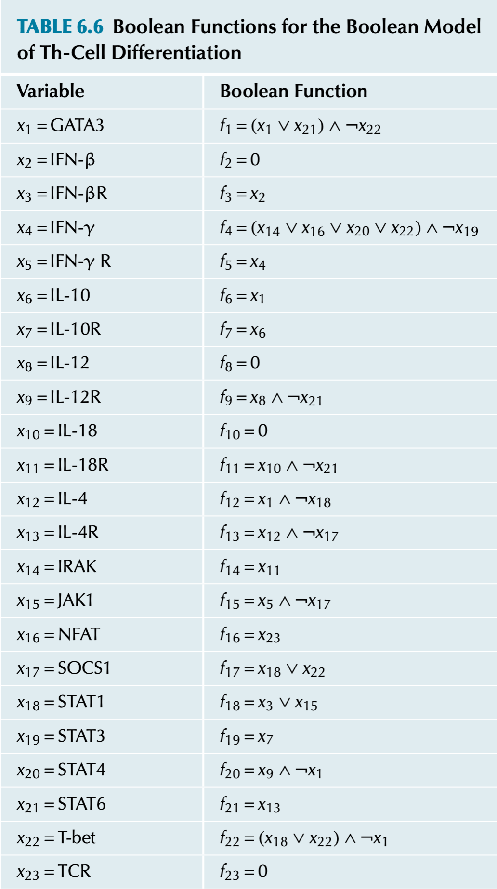

# Tarea 2

## Redes booleanas

1.(30 puntos) La siguiente figura corresponde al paper @joo2018determining. Genera la red en `BoolNet` y reproduce los resultados de la figura. 
 12.47.50.png)
Las reglas boolenas se encuentran en la información suplementaria de dicho artículo.
Discute tus resultados.

2. (30 puntos) La siguiente figura corresponde al artículo @mendoza2006network. Esta describe el proceso de diferenciación en linfocitos T. 


Genera la red en `BoolNet` y reproduce los resultados del paper. Discute tus resultados. 

En la figura siguiente están las reglas booleanas correspondientes. En la tabla se usa el símbolo $\land$ para el operador $AND$,  $\vee$ para $OR$, y $\neg$ para $NOT$



## Visualización y análisis de redes
 
3. (10 puntos) utiliza el archivo que se encuentra en la carpeta `01_RawData`, llamado  `star-wars-network-edges.csv` descargado del github de  
[Pablo Barbera](https://github.com/pablobarbera/data-science-workshop/blob/master/sna/data/star-wars-network-edges.csv). Esta es una lista de adyacencia del episodio IV de Star Wars. Esta es una red personajes de dicha película y están conectados si compartieron una escena. El peso corresponde al número de escenas en las que estuvieron ambos personajes. Elabora un script en R que cargue la red junto con los pesos y:

- Visualice la red
- Encuentre la distribución de conectividades.
- Clusteriza la red, con al menos tres métodos diferentes,  usando los pesos de las conexiones.
- Encuentra el diámetro de la red.
- Visualiza la red en donde se refleja alguna propiedad topológica  asociada a las conexiones. La siguiente instrucción puede ser útil ```E(g)$width <- log(E(g)$weight) + 1``` en donde `g` es el objeto tipo igraph que creaste previamente.

Adicional: Realiza lo mismo pero usando Cytoscape.

4. (10 puntos) Ve a al [Network Repository](https://networkrepository.com/) y descarga una red, de alrededor de 100-200 nodos, en formato lista de adyacencia. Carga y visualiza tu red en Cytoscape.
 
 - Visualiza la red con, al menos,  tres distintos layouts.
 - Obten la distribución de conectividades.
 - Genera un análisis topológico de la red.
 - Modifica el estilo de la red tanto de los nodos como de las conectividades.

En esta parte utiliza screenshots para indicar cómo hiciste cada procedimiento en Cytoscape, además de los resultados de cada parte.
 
## Redes de co-expresión con WGCNA
5. (20 puntos) Observa el tutorial sobre WGCNA de este [video](https://www.youtube.com/embed/q9a2RvqYZzQ) 


```{r}
library(vembedr)
embed_youtube("q9a2RvqYZzQ")
```


del canal **muy recomendable**: **LiquidBrain Bioinformatics** de [Lian Chee Foong](https://sites.google.com/view/liancheefoong/home). Sigue el tutorial de WGCNA qu está en su cuenta de [Github](https://github.com/Lindseynicer/WGCNA_tutorial/tree/main). Es decir descrgar la carpeta y sigue el tutorial dentro que se llama  `WGCNA_tutorial_Rscript.R`. Comenta tus resultados al código y genera las gráficas hasta la línea de código 412. El resto, es opcional.

## Referencias
